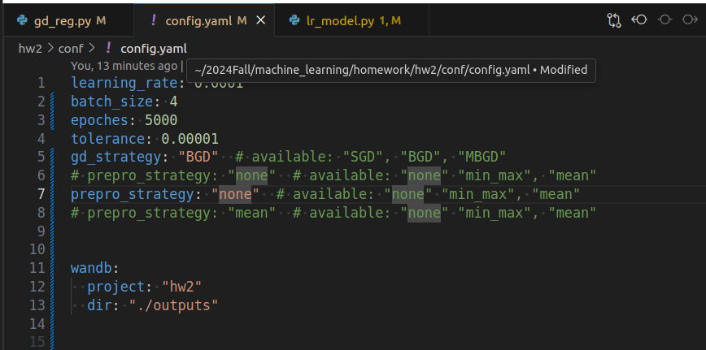
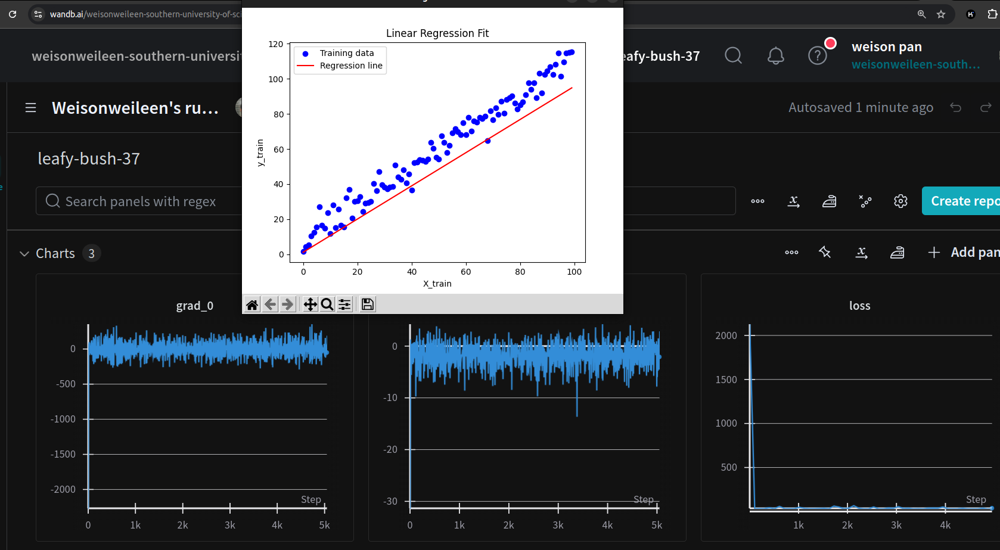
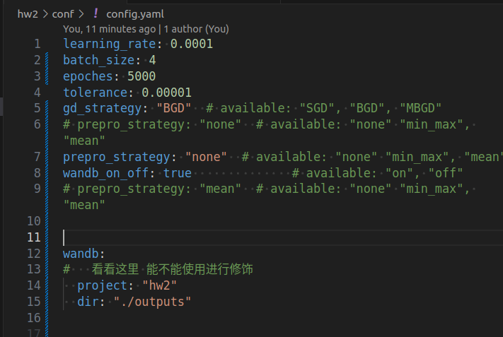
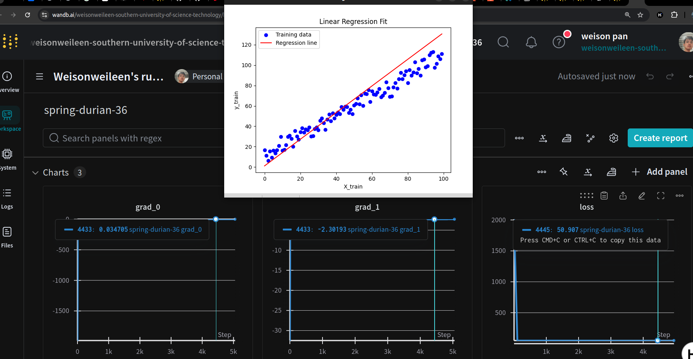
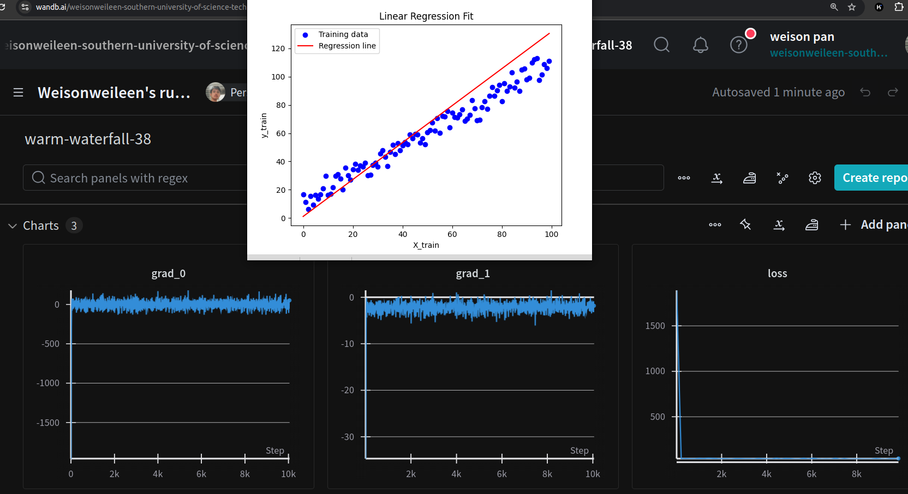
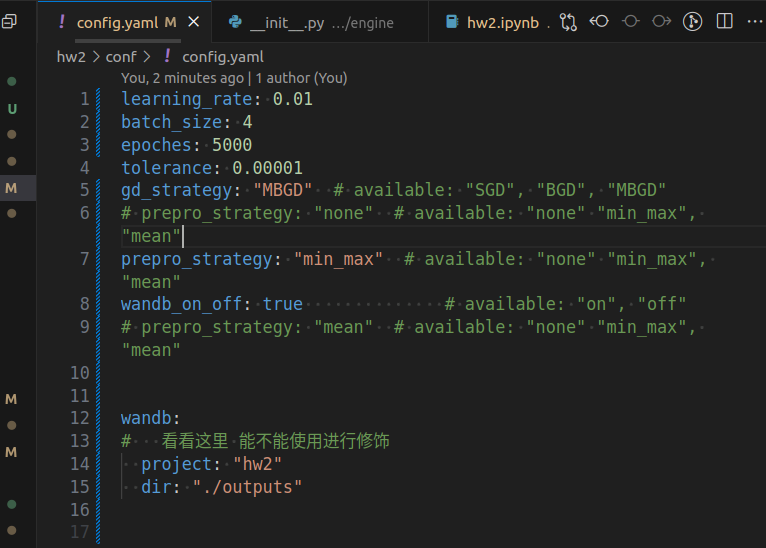
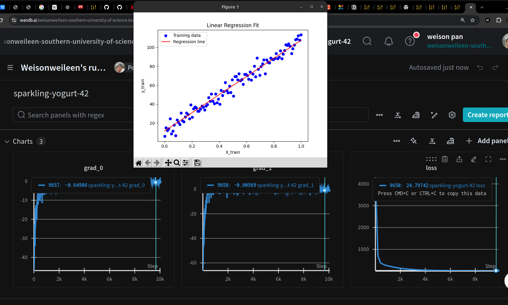
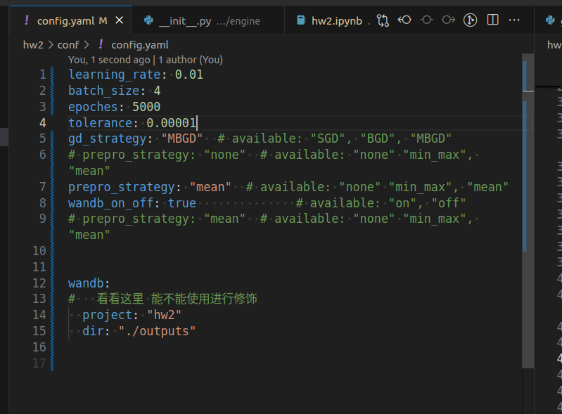
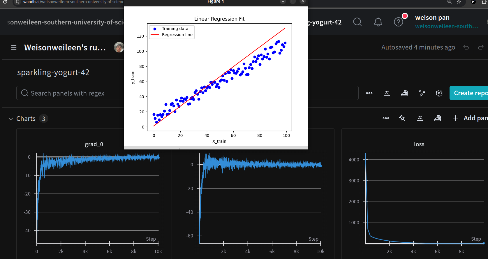

# AI and Machine Leanring homework02 
### 12211810 潘炜

code: https://github.com/WeisonWEileen/homework_sdm274/tree/master/hw2
you can change the param in yaml to reproduce all the metion metioned in the report.

---

### SGD

参数配置

__运行结果__:

- 可以看到loss是最终是到37.多，但是到最后loss在最后几个 epoch还在跳动，说明了其随机性的特点。
- gradient整体比较小

### BGD

- gradient 一开始很大，后面很小
- loss稳定在 50 左右

参数配置

运行结果：

### MBGD

- loss结果稳定在 40~43左右
- gradient分布均衡，但是方差没有 SGD 的方法大

### Min-Max + MBGD （learning rate 在这里需要调大一点）

参数配置：

结果：

- loss： 稳定在 26左右，梯度逐渐下降，趋于0

### mean + MBDG

参数配置：

结果分析：

- loss： 稳定在 26左右，梯度逐渐下降，趋于0

