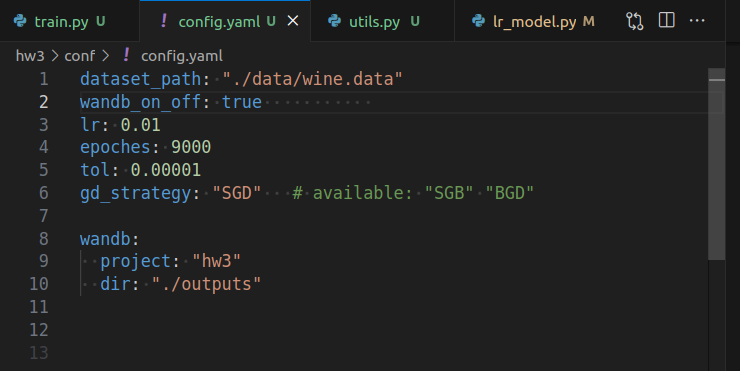
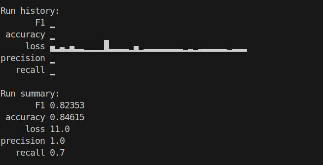
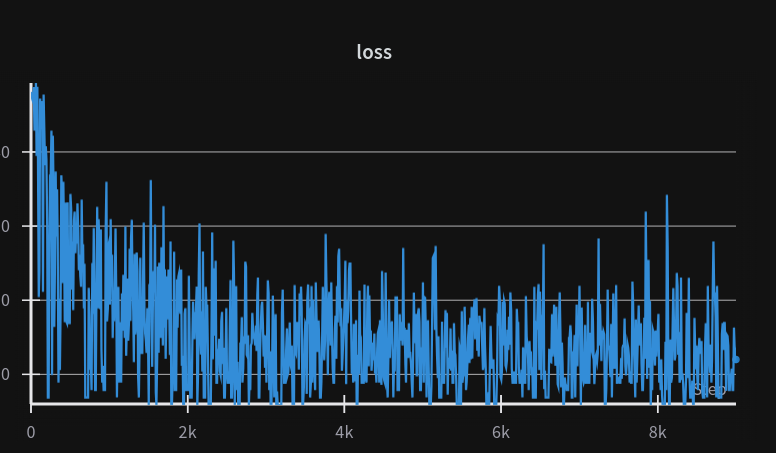
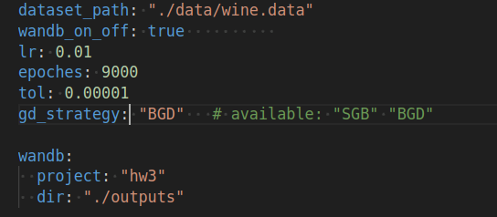
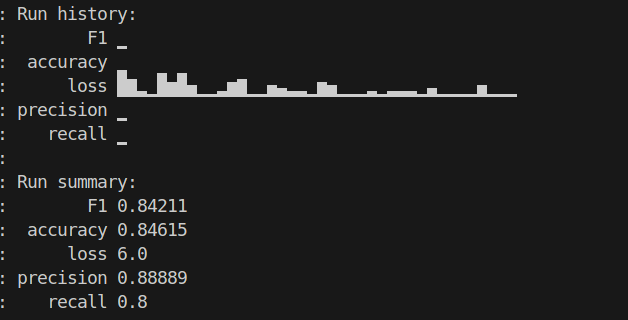
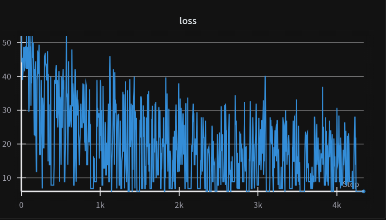

# AI and Machine Leanring homework03 
### 12211810 潘炜


code: https://github.com/WeisonWEileen/homework_sdm274/tree/master/hw3
you can change the param in ```config.yaml``` to reproduce all the results metioned in the report.

---

### SGD

参数配置



运行结果: 训练并没有 early stop





### BGD

参数配置



运行结果：__在```epoch=4k```就模型收敛了__,early stop




