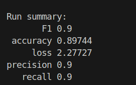

# AI and Machine Leanring homework04

### 12211810 潘炜

code: https://github.com/WeisonWEileen/homework_sdm274/tree/master/hw4
you can change the param in ```config.yaml``` to reproduce all the results metioned below.

# SGD

params for this run


loss


4 metrics: (这里的loss只表示最后一个epoch的loss)


analysis

# MiniBGD

params


loss


metrics (loss只表示最后一个epoch的loss)



# difference between perceptron and logistic regression model

和第三次作业的 perceptron 对比，最终收敛的 loss 比较平稳比较快收敛（虽然loss的定义不同不可以直接比较，但是可以比较趋势），四个metrics的表现也比较好，其原因是：

- **Perceptron**：Perceptron looks for a linear hyperplane that maximizes the spacing between classes, but provides no probabilistic information. It converges only if the data is linearly separable, otherwise it may not

- **Logistic Regression**：Logistic regression also uses linear hyperplanes, but it produces a smooth probabilistic output, so it can find an optimal fit even if the data is linearly indivisible
