# AI and Machine Learning homework 05 MLP

### 12211810 潘炜

code: https://github.com/WeisonWEileen/homework_sdm274/tree/master/hw5

online report (click to check the latest report I submiit):

you can change the param in ```config.yaml``` to reproduce all the results metioned below.

### MLP

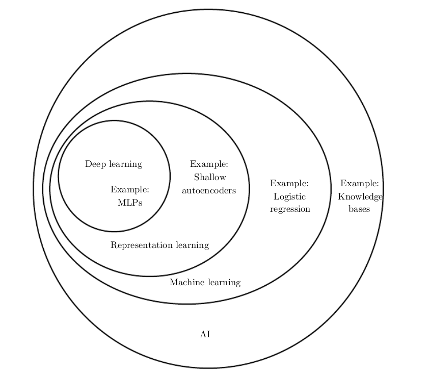

Multiple Layer Perceptron is a classical deep learning model, based on universal approximation theory, it can approximate any function as its depth increase.

# Nonelinear fitting

### nonelinear function

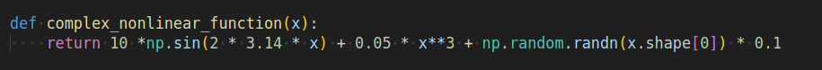

## Mini- Batch 

## hyperparameters

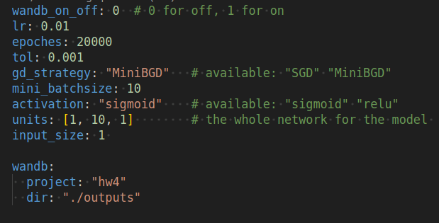

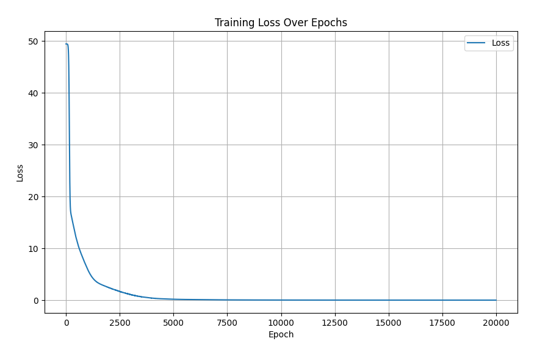

final loss 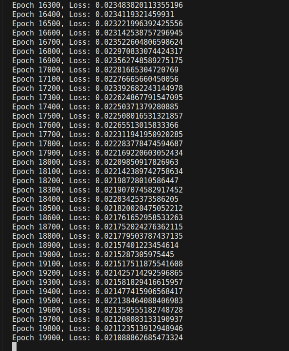

## SGD

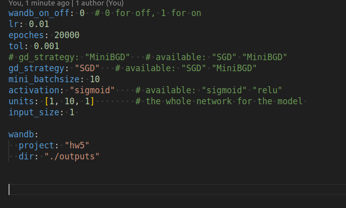

### 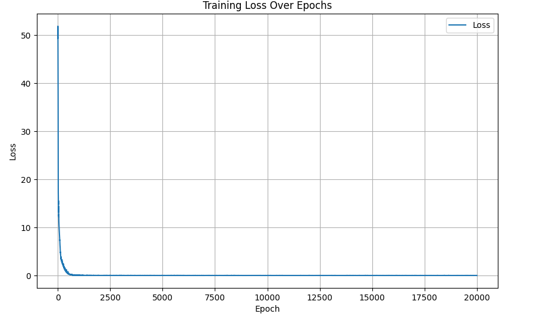

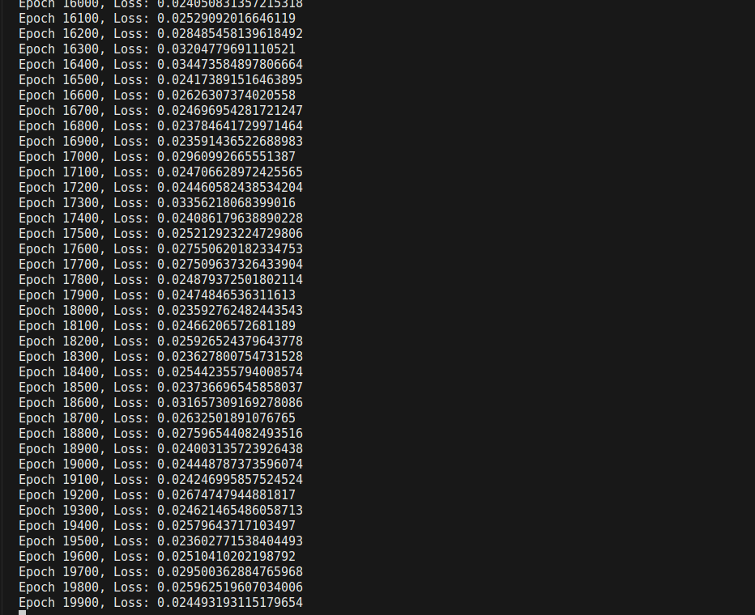

### Conclusion

- ,Adding more layers (depth) or neurons (width) increases the model’s capacity to capture intricate nonlinear patterns.

- some times we need to consider the computational loss. The more complex the model is, the more computation time it takes.


### using K-fold Cross validation  to find the best hyperparameter sets

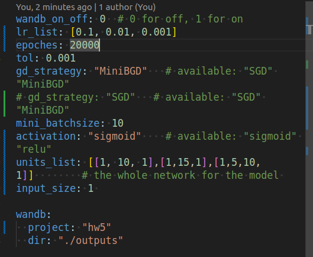

the runing best set 

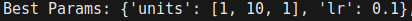

### Conclusion

the deeper the network doesn't mean that the better it is, 而且神经网络并不是都是具有可解释性的，我们需要试出来最好的结构

# Classfier

### generate dataset using method ```make_blobs``` in  ```scikit-learn``` 

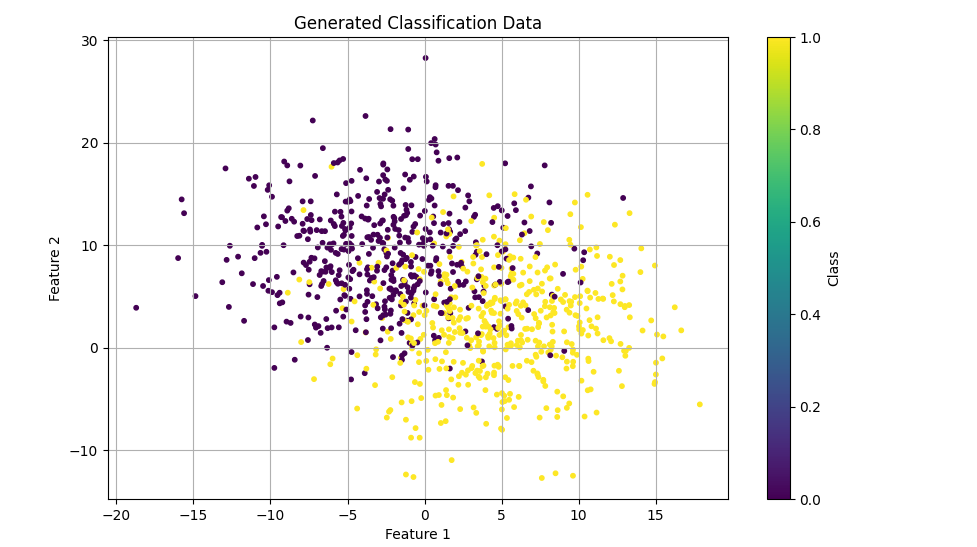

### run configuration

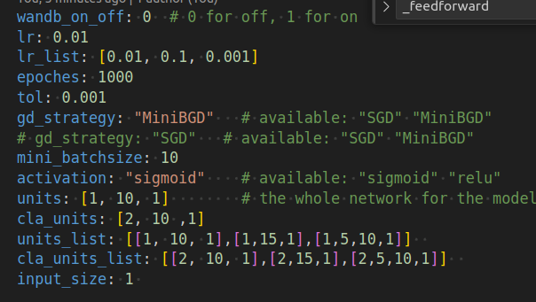

### all run results runing using k_fold = 5

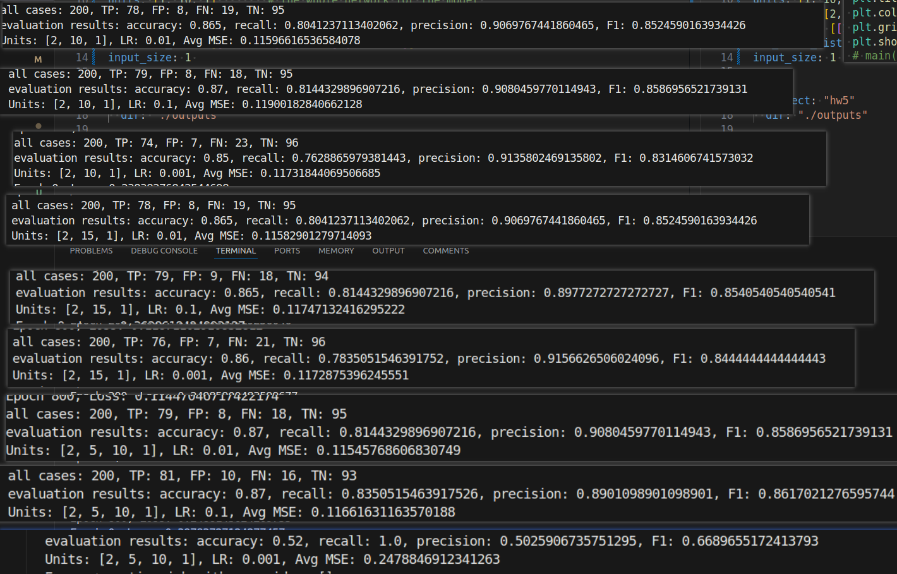

the best configuration is   ```units=[2,5,10,1], lr=0.01``` 

at the best test, we compute 4 metrics

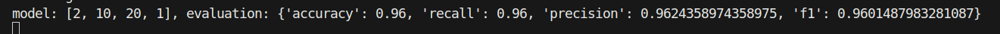


### Decision boundry visualization

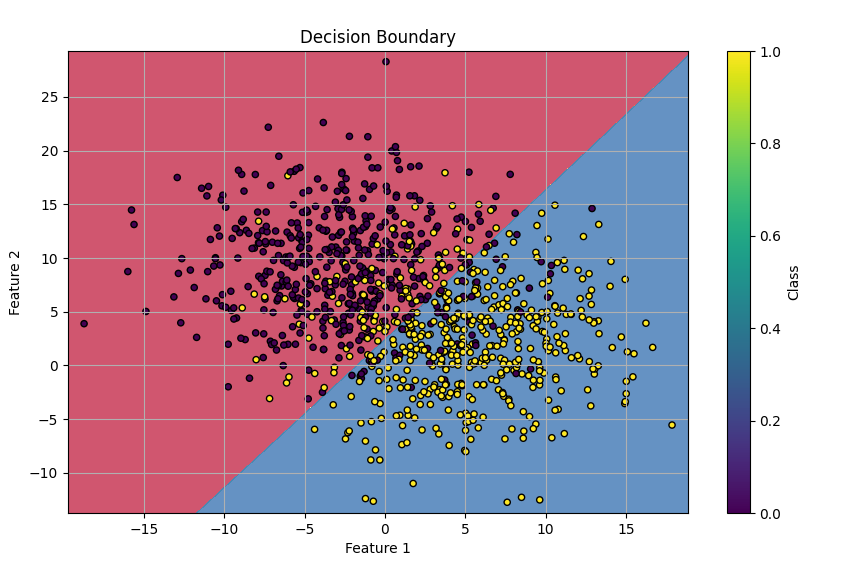

### Conclusion

- when increase model complexity, the boundry may be more curve, that may be overfitting
- The MLP’s hidden layers with nonlinear activation functions allow it to model complex, nonlinear decision boundaries that separate different classes effectively, which is beneficial for datasets that are not linearly separable.

### things to improve

- change the loss function to cross entropy loss function

  