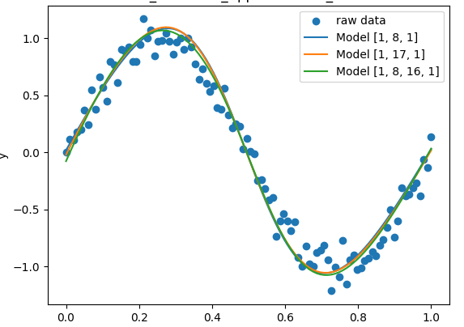

# AI and Machine Learning homework 05 MLP

### 12211810 潘炜

code: https://github.com/WeisonWEileen/homework_sdm274/tree/master/hw5
you can change the param in ```config.yaml``` to reproduce all the results metioned below.

### MLP


Multiple Layer Perceptron is a classical deep learning model, based on universal approximation theory, it can approximate any function as its depth increase.

# Nonelinear fitting

### nonelinear function


### hyperparameters


### Plotting results of 3 different layers trys

I try 3 different layers, and plot the output here.  



the final loss 


### Conclusion

- ,Adding more layers (depth) or neurons (width) increases the model’s capacity to capture intricate nonlinear patterns.

- some times we need to consider the computational loss. The more complex the model is, the more computation time it takes.

# Classfier

generate dataset helped by **ChatGPT**


layer:```[2,10,1]```: final loss :0.05125819234234

 

layer:[1,17,1]: final loss : 0.04129081951076237


layer:[2,10,20,1] final: loss 0.04296898704408965


loss plotting


at the last test, we compute 4 metrics


### Conclusion

- when increase model complexity, the boundry may be more curve, that may be overfitting

- The MLP’s hidden layers with nonlinear activation functions allow it to model complex, nonlinear decision boundaries that separate different classes effectively, which is beneficial for datasets that are not linearly separable.