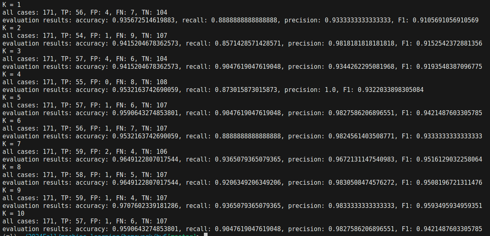
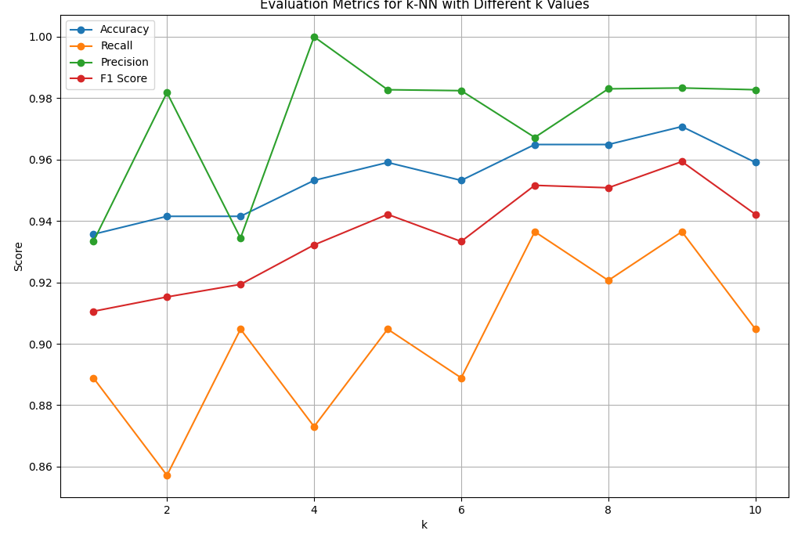

# AI and Machine Leanring homework06
### 12211810 潘炜

code: https://github.com/WeisonWEileen/homework_sdm274/tree/master/hw6
you can change the param in ```config.yaml``` to reproduce all the results metioned in the report.

---

### 运行结果： 随着 k 从 0~9 增长，4个 metric大致规律逐渐变好





### 分析结果

在 ```k=9```附近，4 个评价的 metric 平均表现最好, 此时周围的**邻域样本** **更加有效**

