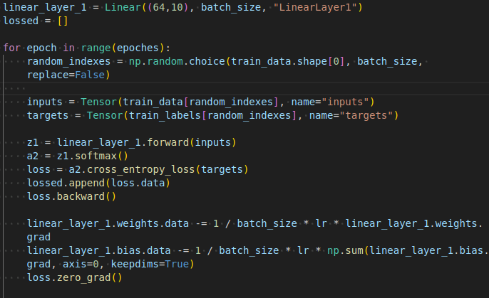

# AI and ML homework8 12211810 潘

code : https://github.com/WeisonWEileen/homework_sdm274/tree/master/hw8

## Inplementation Details

### autograd system

受 斯坦福的 Feifei Li 的课程 cs231n [^1]启发，手动写了一个 Tensor 类，用于构建类似 pytorch 的动态图机制，实现  autograd 自动递归传递梯度系统。

### onehot encoding

### training process

I have define partial deriretives to each operants. Just using the autograd system to recursively backward propagation

and here are the training hyperparameters

## MLP structure

### 64 -- linear layer --> 10 ->  softmax

### loss

### accuracy : 0.9398

### Reference

[^1]: Lin, T., Goyal, P., Girshick, R.B., He, K., & Dollár, P. (2017). Focal Loss for Dense Object Detection. IEEE Transactions on Pattern Analysis and Machine Intelligence, 42, 318-327.

