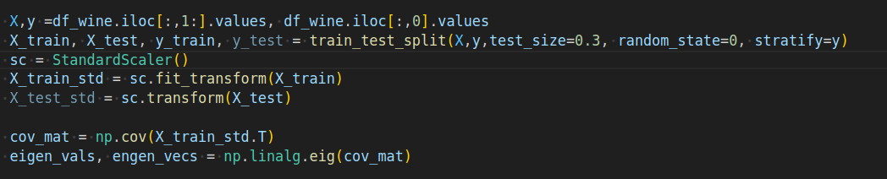
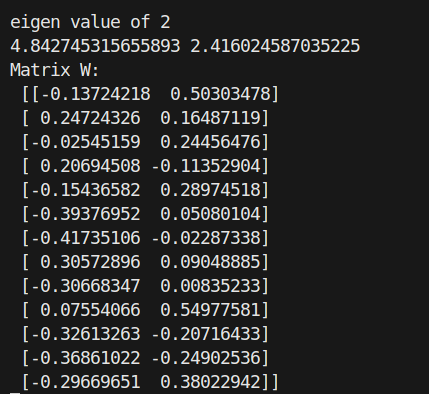
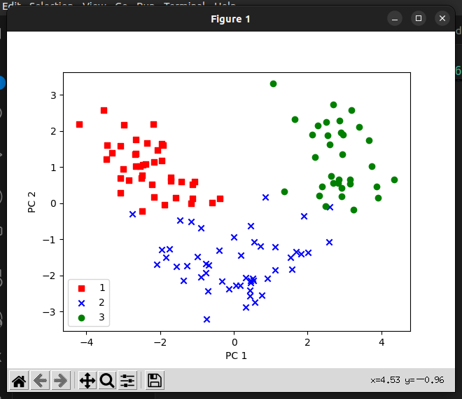
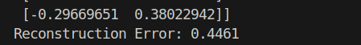
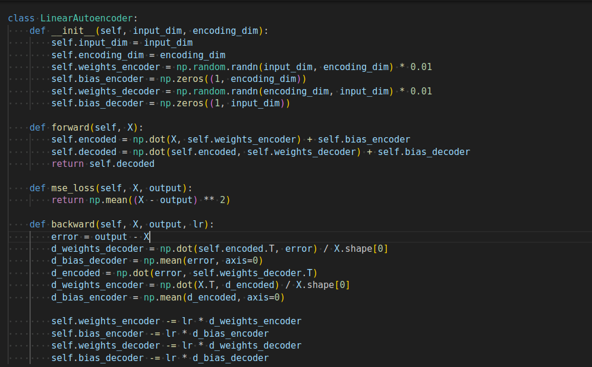
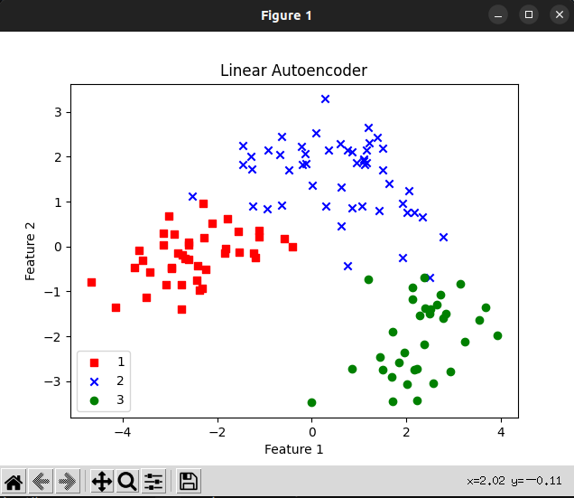
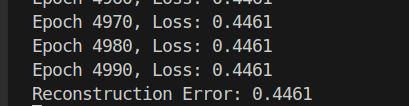
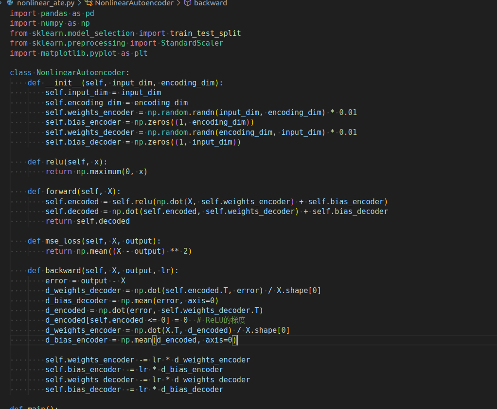
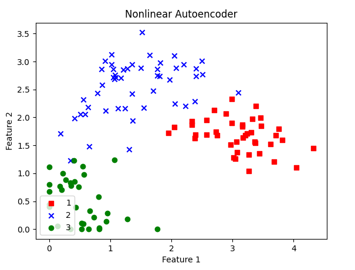
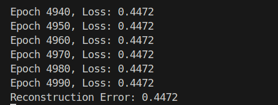

# 12211810 潘炜 AI and Machine Learning hw 9

code: https://github.com/WeisonWEileen/homework_sdm274/tree/master/hw9

you can change the param in ```config.yaml``` to reproduce all the results metioned in the report.

### PCA \

code for the pca



we consider the two component, which is 



then we reconstruct it, and visualize the result 	



reconstruction error:



### Linear AutoEncoder






reconstruction error:



### None-Linear Auto-encoder

使用一层 Relu 作为 activation function





recontruction error



### Comparison and Analysis

- error : pca = linear autoencoder < nonlinear autoencoder

- 由于所有维度的数据均是做了**去中心化**的处理。这意味着：只要训练的超参数合理，PCA 和 linear Autoencoder 是等价的，而上面跑的代码得到的reconstruction error也是一致的. 而 带一层 activation function 为 relu 的结果稍逊，但是也没有差到哪里去。pca和linear ate 比 none-linear autoencoder 更加好的原因可能是，这个数据集的数据更加偏向**线性可分**