## midterm report

**12211810 潘炜**

### data preprocessing

extract data from the csv file, data split the data into training set and test set

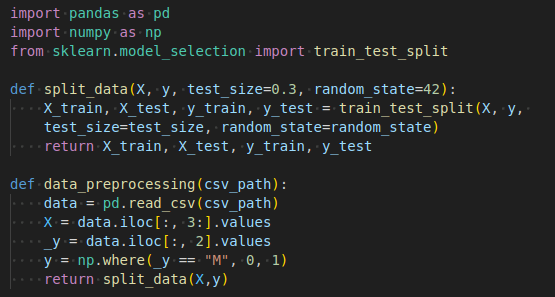

### feature engineering

compute the corrolation heatmap

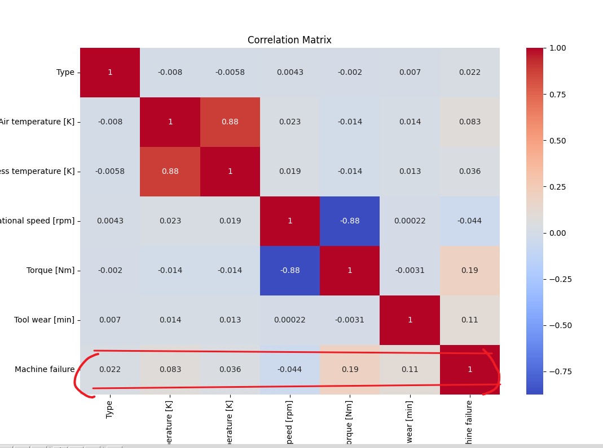

sorted by correlation coefficient

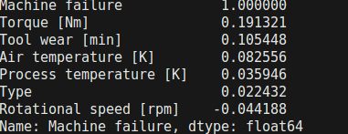

base on the correlation map

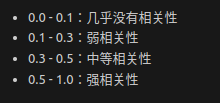

hence we choose  ```Torque```, ``` Tool wear```, ```Air temperature``` these 3 feature as our input feature, and ignore other features. Below is the code for feature choose.

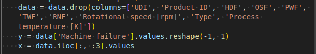

## Model inplementation

### linear regression

- inplementation detail:
  - since the samples of the machine failure is unbalanced(about 2907(machine failure = 0) : 97(machine failure = 1) in test set), we need to change the decision boundarydecision boundary .should be set very small ( < 0.3) for this case.
  - remember to normalize the input detail

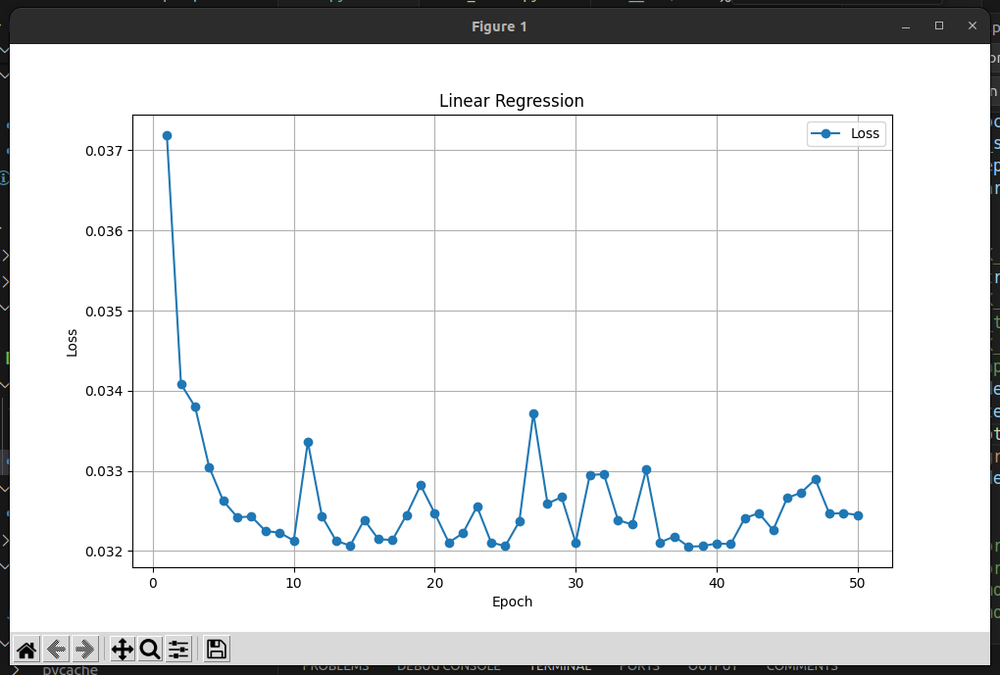

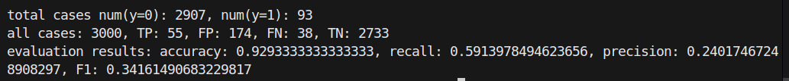

### perceptron

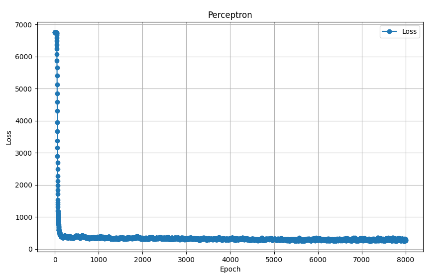

performance and 4 metrics

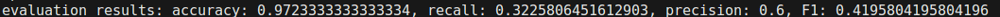


### logestic regression

loss

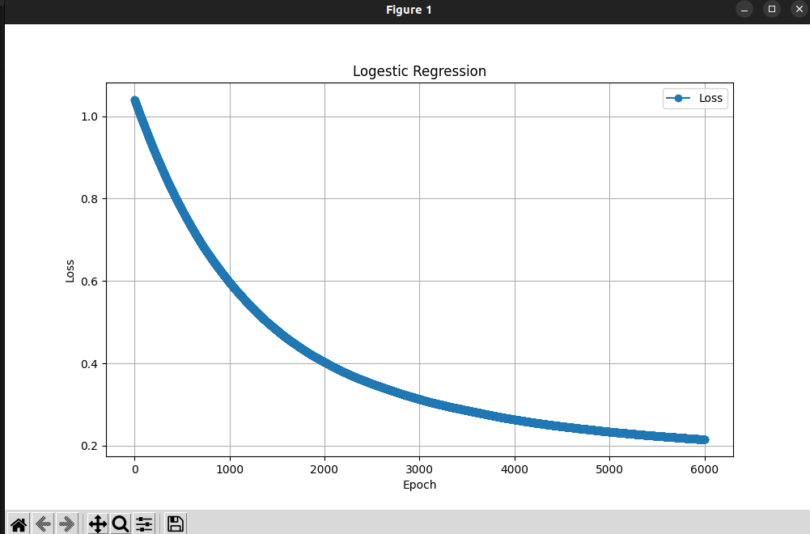

4 metrics

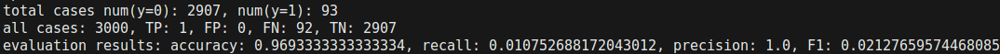

### Multiple Layer perceptron

loss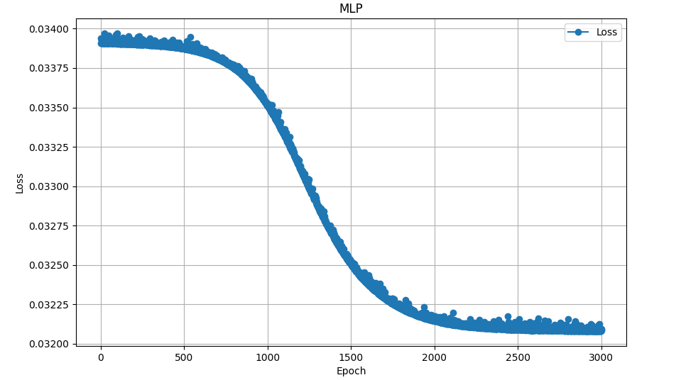

pr 曲线

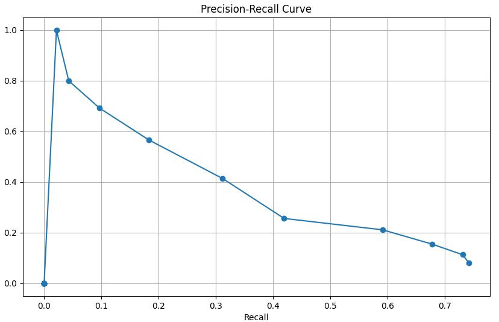

pr 曲线的点对应的metrics

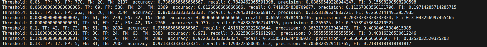
