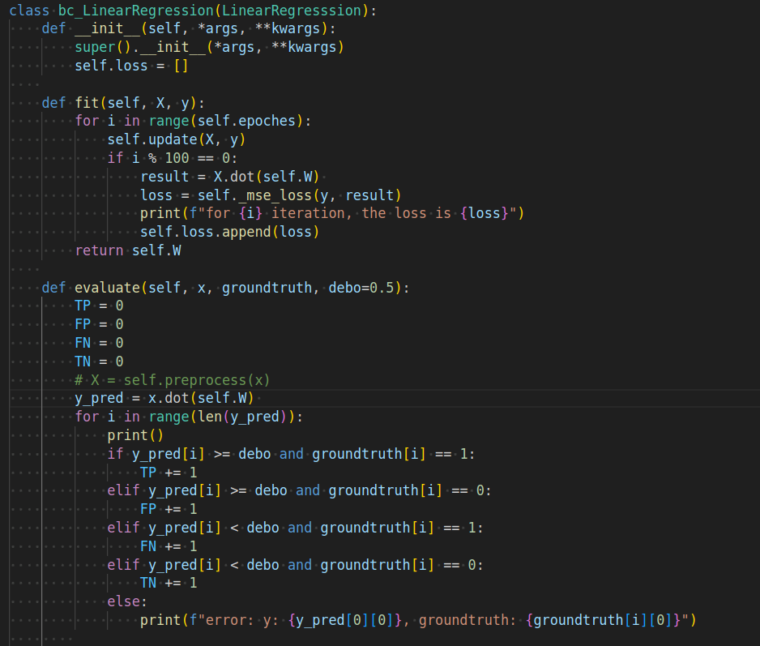
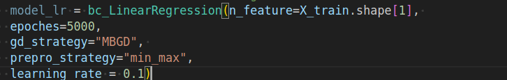
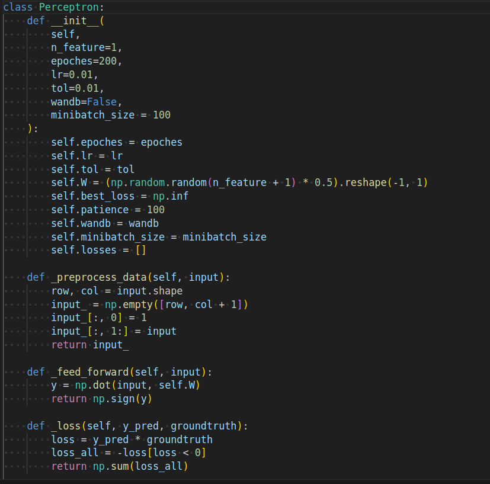
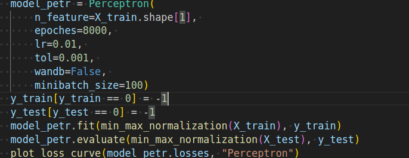
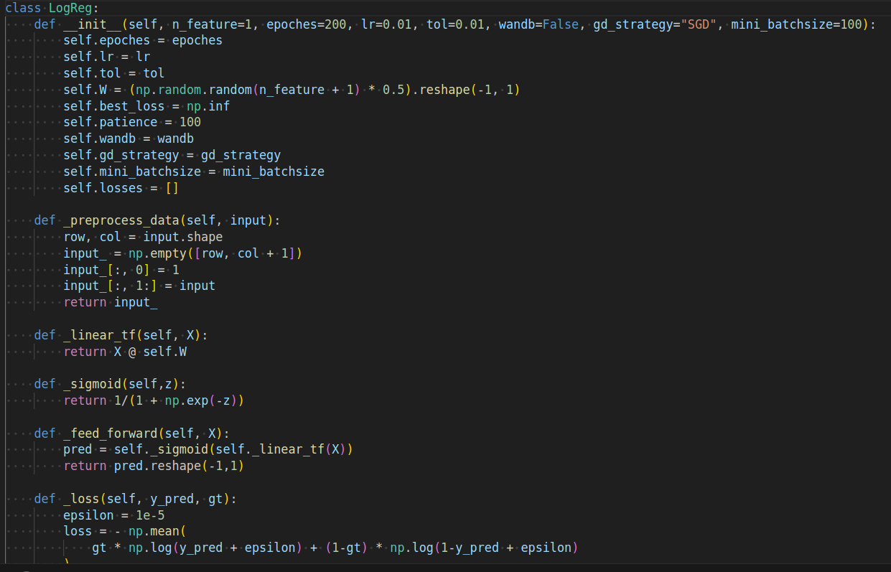
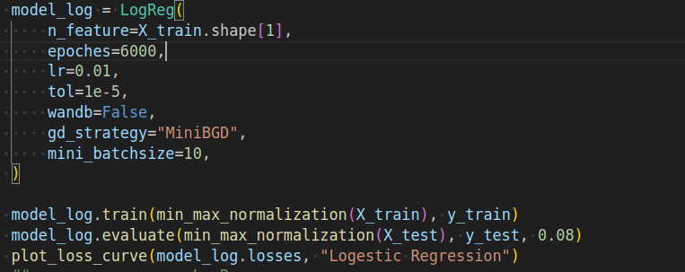
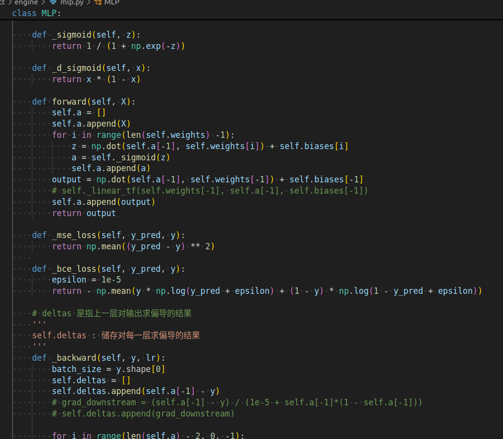
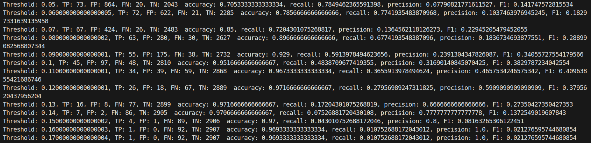
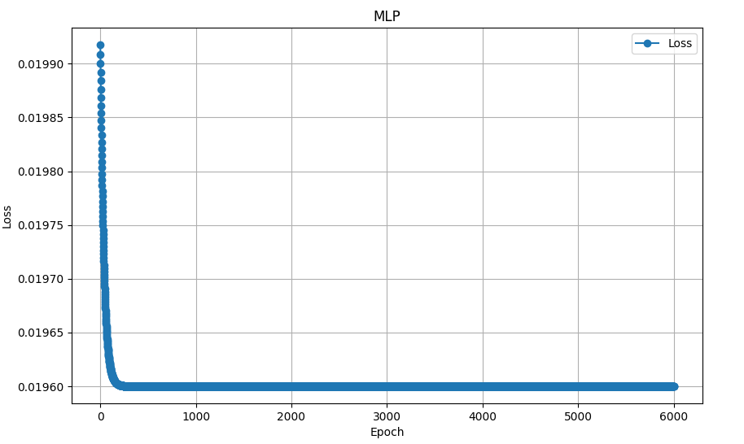

##                    midterm report                   12211810 潘炜
最新版的report和代码链接：https://github.com/WeisonWEileen/homework_sdm274/blob/master/project/report/report.md
****

# Special things I make in the reop
### 作为二分类，0 1样本严重不平衡
### 数据集不均衡问题

7：3 选择测试集和验证集，在样本量为3000的验证集中，只有93个样本```Machine Failure=1```。一种办法是可能是

- 使用 Zhiyun Lin 老师在wechat群提到的在loss上面加 weight
- drop掉一部分 ```Machine Failure=0``` 的样本。
- 使用 data-argumentation 对 Machine Failure 样本进行增强
- 另一种方法是使用 KaiMing He 团队 在 Facebook 时工作的时候发表的
  Focal loss[^1] 来解决这个问题， 其最初是为了解决 foreground-background class imbalance 的不平衡的问题。 （后面有时间再尝试这个方法）

这里由于时间的原因，尝试第二种方法

# Implementation Detail

### data preprocessing

extract data from the csv file, data split the data into training set and test set


# feature engineering

### normalization

**Normalization** is an essential preprocessing step in data analysis and machine learning. And since the scale differs with each other greatly， in this repo we use the min-max normalization to normalize the data

### compute the corrolation heatmap


sorted by correlation coefficient


base on the correlation map


hence we choose  ```Torque```, ``` Tool wear```, ```Air temperature``` these 3 feature as our input feature, and ignore other features. Below is the code for feature choose.


## Model inplementation

### linear regression

part of code 


- inplementation detail:
  - since the samples of the machine failure is unbalanced(about 2907(machine failure = 0) : 97(machine failure = 1) in test set), we need to change the decision boundarydecision boundary .should be set very small ( < 0.3) for this case.
  - remember to normalize the input detail


### parameter tuning of linear regression

here is the param I run 




### perceptron

part of code 



we can see that perceptron work with 


performance and 4 metrics


### parameter tuning of perceptron



### logestic regression

code


loss


4 metrics


### paramter tuning



### Multiple Layer perceptron

code



loss


### paramter tuning of MLP

pr 曲线


pr 曲线的点对应的metrics



**reduce the samples** to 300

样本更加均衡，the loss更快收敛



### Model Comparison ： based on best F1 score I get

Among all models, the Logestic regression and MLP model perform the best , however, we need to choose the right threshold to precision and recall balance. The rank of the best model in the parameter I tried:

1. Multiple Layer Perceptron
   0.45

2. Logestric Regression
   0.4

3. Perceptron
   0.37

4. Linera regression
   0.26

   Hence, I MLP perform best on this dataset.


### Reference

[^1]: Lin, T., Goyal, P., Girshick, R.B., He, K., & Dollár, P. (2017). Focal Loss for Dense Object Detection. IEEE Transactions on Pattern Analysis and Machine Intelligence, 42, 318-327.