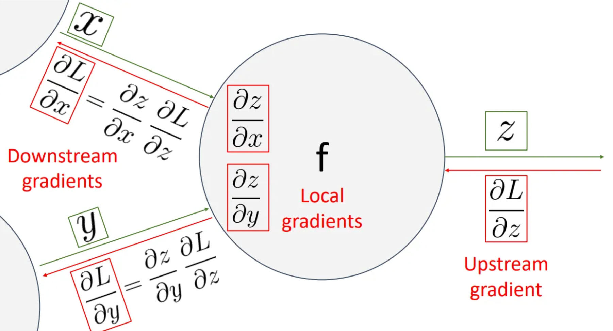

### Assignment with bonus AI and Machine Learning

12211810   Wei Pan   Robotics

## Error in Lecture slides
Lecture 3 - Page 63 ：GBD —> BGD
Lecture 4 - Page 20：molel parameters —> model parameters
Lecture 5 - Page 53
Monitor loss during rraining —> Monitor loss during training
Lecture 7 - Page 15
descend ateach level —> descend attach level
Lecture8 - Page 23
Foward propagation —> Forward propagation
Lecture11 - Page 44
sovle —> solve

## Clarify Difficult Concepts
#### kmeans 

#### pca for dimension reductoin
based on their eigen value, we chose those eigen vector that matters a lot to do **dimension reduction**. 

#### linear svm
it is a good margin based classifier. however, there are some pros and cons of svm

### kernel tricks, dual representation and KKT condition

- **Kernel Trick** provides a way to map data into a higher-dimensional space to handle non-linear problems;

- **Dual Representation** simplifies the optimization problem through its dual form and makes kernel methods effective;

- **KKT Conditions** provide the necessary conditions to verify the optimality of the solution and ensure the correctness of the support vectors.

#### AdaBoost

AdaBoost improves the performance of weak learners by iteratively reweighting training samples and combining multiple weak classifiers into a strong classifier. The key idea is to focus on the mistakes made by previous classifiers and give more importance to hard-to-classify samples, ultimately leading to a more accurate model.

## Clarify difficult Concepts
#### gradient
gradient indicates the direction
which function go up most fastly

#### classification metrics
we must understand the four metrics so that we can 

### backpropogation
we must understand the chain rule which enables the gradient flow.

### kd tree
it is a beautiful tree structure, however it took lots of memory.

### information gain
we must know the reduction in entropy matters

### softmax for mc

# key concept

### a beautiful code of backpropogation
build a autograd system, do as pytorch do

### Universal approximation theorem of MLP
though it can not be proved mathematically, but it still very powerful and useful. A simple MLP is used everywhere.

### AdaBoost 
AdaBoost improves the performance of weak learners by iteratively reweighting training samples and combining multiple weak classifiers into a strong classifier. The key idea is to focus on the mistakes made by previous classifiers and give more importance to hard-to-classify samples, ultimately leading to a more accurate model.

# some problems

### what is the connnection between hinge loss and svm? can we use hinge loss to reformulate svm?

the form hinge loss
$$
l(y) = \max (0, 1-t\cdot y)
$$
the form of constrain in svm 
$$
y_i(w^Tx_i-b)-1\ge0
$$

### Suggestion about this course
#### deep learning coverage

Thanks for **Prof. Lin and TAs** helping me gaining an insight into many machine learning models, including svm, boostrap. **However, traditional Machine Learning has very limited power.** I think we should gain more insight into deep learning. Object detection use CNN and Vit, which is very popular, NLP use sequence2sequence model , Reinforcement learning uses DQN.
### Why Traditional Machine Learning Alone is Not Enough

1. **Feature Engineering**: Traditional machine learning models often require extensive feature engineering. This means that domain experts need to manually select and transform raw data into meaningful features. This process can be time-consuming and may not always capture the underlying patterns in the data.

2. **Scalability**: Traditional machine learning algorithms may struggle with large-scale data. As the volume of data grows, these algorithms can become inefficient and may not perform well.

3. **Complexity**: Traditional machine learning models may not be able to handle complex data structures, such as images, audio, and text, as effectively as deep learning models.

### Why Deep Learning is Important

1. **Automatic Feature Extraction**: Deep learning models, particularly neural networks, can automatically learn and extract features from raw data. This reduces the need for manual feature engineering and allows the model to discover intricate patterns.

2. **Handling Large Datasets**: Deep learning models can handle large-scale datasets more effectively. They can leverage vast amounts of data to improve performance, making them suitable for big data applications.

3. **Complex Data Representation**: Deep learning models excel at processing complex data types, such as images, audio, and text. Convolutional Neural Networks (CNNs) are particularly effective for image recognition, while Recurrent Neural Networks (RNNs) and Transformers are powerful for sequence data like text and speech.

4. **State-of-the-Art Performance**: Deep learning models have achieved state-of-the-art performance in various tasks, including image classification, natural language processing, and speech recognition. Their ability to model complex relationships and patterns has led to significant advancements in these fields.

##### Conclusion

While traditional machine learning techniques are still valuable and applicable in many scenarios, deep learning has become increasingly important due to its ability to automatically extract features, handle large datasets, and process complex data types. This has led to significant improvements in performance and has opened up new possibilities in various domains.