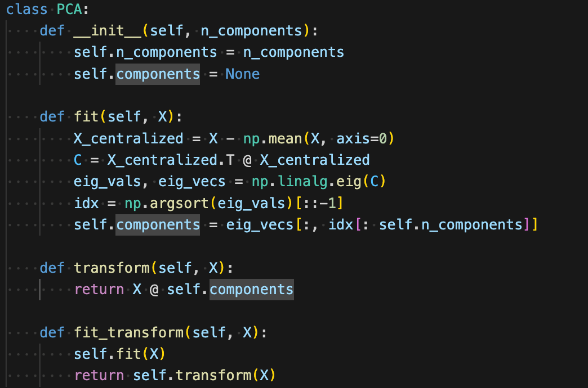

# Final project
## 12211810 Pan Wei 

### Contents
1. **Abstract**
2. **Code Inplememtation and analysis**
3. **feature of the seed dataset**
3. **Discuss**
4. **Findings**
5. **Conclusion**
### Abstract
I use this this project to analyze and classify the wheat seed dataset using a variety of
machine learning techniques, including K-Means++, soft K-means, Principal Component
Analysis (PCA), Nonlinear Autoencoders, Multi-Layer Perceptron (MLP), Support Vector
Machines (SVM), SVM with Gaussian kernel, and AdaBoost. The project will compare the
performance of these methods on both multi-class and binary classification tasks. Here I will show the details of my inplementation and analysis.


### code Inplememtation and analysis

### K-Means++ 
1. code

2. apply to dataset with k=3


### Soft-Kmeans
1. add a matrix U relative to kmeans ++

2. apply to dataset with k=3


### PCA
1. using ```np.linalg``` to get eigenvectors

2.  reduce dim to 2 or 3, respectively


### None-linear Auto-encoder
1. using ```relu``` as activation function and MSE as loss

2. reduce dim to 2 or 3, respectively


### clustering with reduced Dimensions
#### using data from PCA and nonelinear-autoencoder
compared with those results above we can see that the cluster result is more smooth(**since by dimension reduction, the scale of data may differ with each other, so we can not directly apply SSE(sum of squared errors) to compare**)
pca

nonelinear-autoencoder

### MLP
1. use one hidden layer with 16 neurons 


**accuacy=0.928**

2. 

### SVM and SVM with Gaussian Kernel
code

as we can we see,**when we use Gaussain kernal,we can map features into a higher dimensional feature space so that they are more linearly seperated easily**, and the accuracy is more higher.


### 8. AdaBoost Algorithm
code. here I use 30 weak classifier to combine them together and get a accuaracy of $85.71\%$ 


### compare binary claasification accuracy
remove those ```label=2```

#### accuracy
MLP(a hidden layer with 16 neurons): $92\%$
SVM: $85\%$
SVM with Gaussain: $89\%$
adaboost $85.71\%$
####  comparision
1.	MLP (a hidden layer with 16 neurons): 92%
	-	The MLP performs the best with a 92% accuracy. This suggests that it is able to model the data effectively, and the single hidden layer is sufficient to capture complex patterns in the data.
2.	SVM: 85%
	-	The basic SVM performs at 85%, which is lower than the MLP. While SVM is a powerful classifier, it may struggle with complex, non-linear patterns compared to neural networks like MLP.
3.	SVM with Gaussian kernel: 89%
	-	The SVM with a Gaussian (RBF) kernel improves to 89%, showing that the kernel trick helps SVM handle non-linearity better. However, it still doesn’t outperform the MLP.
4.	AdaBoost: 85.71%
	-	AdaBoost performs similarly to the basic SVM with an accuracy of 85.71%. AdaBoost is an ensemble method that combines weak classifiers, but it doesn’t seem to outperform MLP in this case.
## Discuss

***MLP (92%) - Best Performance***

-	The MLP achieves the highest accuracy (92%), which indicates that this model is the best at learning the complex patterns in the data.
-	Implication: MLP, being a neural network with a hidden layer, is highly flexible and capable of learning non-linear relationships between input and output. The model’s performance likely reflects its ability to handle high-dimensional and complex data.
-	Reasoning: Neural networks are known for their ability to approximate complex functions, which could be the reason why MLP performs so well. The single hidden layer with 16 neurons seems sufficient to capture the underlying patterns, assuming the data is not too noisy or lacks structure.
-	When to Use: MLP is a good choice when the problem requires capturing complex, non-linear relationships, and when you have enough data to train a deep model.

***SVM with Gaussian Kernel (89%) - Improved Performance***

-	Using a Gaussian kernel (RBF) improves the SVM’s performance to 89%, showing a significant improvement over the standard SVM.
-	Implication: The Gaussian kernel helps SVM handle non-linear data by implicitly mapping the data into a higher-dimensional space, allowing for better separation between classes. The improvement shows that the original SVM may not have been able to model the complexity of the data adequately.
-	Reasoning: The RBF kernel is capable of capturing non-linear relationships, which is why the SVM with this kernel performs better than the standard SVM. However, it still falls short of the MLP, indicating that SVM with a Gaussian kernel is still not as effective at capturing the complexity of the data as the neural network.
-	When to Use: SVM with Gaussian kernel is particularly useful for non-linear data, and it works well when the dataset is small to medium-sized. If you’re unsure whether the data has linear separability, using the RBF kernel is often a good default.

***SVM (85%) - Moderate Performance***
-	The basic SVM performs at 85%, which is significantly lower than MLP.
-	Implication: SVM is a powerful classifier in linear and low-dimensional spaces. However, in this case, it may not be capturing the underlying complexity of the data as effectively as MLP. This can happen when the data has intricate, non-linear relationships that SVM struggles to capture without the right kernel.
-	Reasoning: SVM tends to perform well in scenarios where the data is linearly separable or has clear margins. However, if the data has complex decision boundaries, SVM’s linear kernel might not suffice without additional tuning.
-	When to Use: SVM is a good option when the data is well-behaved (e.g., separable or with well-defined decision boundaries), and if the data size is relatively small.

## AdaBoost (85.71%) - Similar Performance to SVM
-	AdaBoost achieves 85.71%, which is very similar to the performance of the basic SVM (85%). Both are substantially lower than MLP.
-	Implication: AdaBoost is an ensemble method that combines weak classifiers to improve performance. While it typically performs well in many scenarios, it may not be as effective as MLP on this particular dataset, possibly because the base classifiers used by AdaBoost (often decision trees) might not be able to capture the data’s complexity as well as MLP.
-	Reasoning: AdaBoost can improve the performance of weak classifiers, but if the data has highly complex patterns, a simple decision tree might not suffice, which could explain why AdaBoost does not outperform the other methods here.
-	When to Use: AdaBoost is best for problems where weak learners can be combined to create a stronger model. It is often used for classification tasks with a moderate amount of noise or imbalance.

## feature of the seed dataset
1. Small Size:
	•	The limited number of samples restricts its use in training complex models like deep neural networks.
	•	Small datasets may lead to overfitting and less reliable generalization.
2.	Potential Class Imbalance:
	•	If the number of samples in each class is significantly imbalanced, models may be biased toward the majority class.
3.	Clean Data:
	•	The dataset lacks missing values or noise, which may not reflect real-world scenarios and limits testing of robust algorithms.
4.	Low Feature Dimensionality:
	•	With only 7 features, the dataset might not be sufficient for tasks that require higher dimensional data or feature interactions. 

## Advantages and disavantages in this dataset


1.	Multilayer Perceptron (MLP):
	- Advantages:
	•	Capable of learning non-linear patterns, which might improve accuracy if the data has complex relationships.
	•	Outputs probabilities for each class, providing interpretability in predictions.
	•	Adaptive learning: with hyperparameter tuning, it can fit various types of data well.
	- Disadvantages:
	•	Prone to overfitting, especially on small datasets like the wheat seed dataset, without proper regularization.
	•	Requires extensive hyperparameter tuning (e.g., number of layers, neurons, learning rate) to achieve good performance.
	•	Training can be computationally expensive due to backpropagation and multiple epochs.
2.	Support Vector Machine (SVM):
        ***Linear SVM***:
	- Advantages:
	•	Effective in cases where the data is linearly separable.
	•	Simpler model with fewer hyperparameters to tune.
	•	Computationally efficient on small to medium-sized datasets.
	- Disadvantages:
	•	May fail to model data effectively if it is not linearly separable.

    ***SVM with Gaussian Kernel***:
    - Advantages:
        •	Captures non-linear relationships in data by mapping to a higher-dimensional space.
        •	Good generalization when the kernel and parameters (e.g., C, \gamma) are tuned appropriately.
    - Disadvantages:
        •	Sensitive to the choice of hyperparameters and kernel function.
        •	Computationally expensive, especially for large datasets, due to kernel matrix calculations.
    
3.	AdaBoost:
    - Advantages:
        •	Strong performance with weak learners by combining multiple models to reduce bias and variance.
        •	Adaptive nature makes it robust against overfitting on small datasets like this one.
        •	Handles binary classification well.
    - Disadvantages:
        •	Sensitive to noisy data and outliers, which can dominate weak learner weights.
        •	Performance heavily depends on the choice of weak learners and number of iterations.

## Findings
K-Means++ (Hard Clustering)

- Faster convergence compared to random initialization.
- Likely to find better centroids and produce more accurate clusters than standard K-Means.
- More stable results due to improved centroid initialization.

Soft K-Means (Fuzzy Clustering)

- Handles overlapping clusters well by assigning soft memberships.
- More flexible in modeling data that lies near decision boundaries.
- Works well with real-world data that may have noise or fuzzy cluster boundaries.

### Conclusion
In this course, machine learning is divided into supervised learning and unsupervised learning, here I am going to take a conclusion of both of them using achine learning techniques that I learned.

#### supervised learning 
MLP (Multi-Layer Perceptron): A powerful neural network model that excels at learning complex, non-linear patterns in labeled data. It’s highly flexible and performs well on tasks where data has intricate relationships.
- SVM (Support Vector Machine): A robust classifier that works well on linearly separable data. It can also be extended with kernels (like Gaussian) to handle non-linear data.
- SVM with Gaussian Kernel: Improves upon standard SVM by mapping data to a higher-dimensional space, allowing it to handle non-linear separability effectively.
- AdaBoost: An ensemble method that improves the performance of weak classifiers by combining them into a stronger model. It works well for binary classification tasks, especially when the data has noise or is imbalanced.

**Summary for Supervised Learning**: Supervised learning methods like MLP, SVM, and AdaBoost are designed to classify labeled data by learning from input-output pairs. These methods can handle linear and non-linear relationships, with models like MLP and SVM with Gaussian kernels excelling at complex, high-dimensional tasks.

#### unsupervised learning


- K-Means++: An improved version of K-Means clustering, using smarter initialization to avoid poor convergence. It works well for partitioning data into distinct clusters when you know the number of clusters in advance.
- Soft K-Means: A variant of K-Means that provides fuzzy cluster assignments. It’s useful for data where clusters overlap or aren’t clearly separable, allowing each point to belong to multiple clusters with varying degrees of membership.

**Summary for Unsupervised Learning**: Unsupervised learning methods like K-Means++ and Soft K-Means are used for clustering unlabeled data. K-Means++ is efficient for well-separated clusters, while Soft K-Means handles more complex, overlapping data distributions by allowing soft cluster assignments.